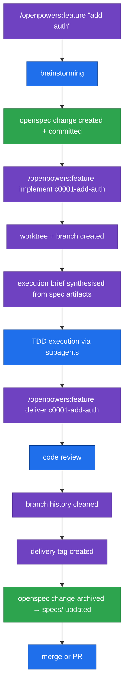

# openpowers

A Claude Code plugin that guides feature development from idea to tagged delivery.
Orchestrates [openspec](https://openspec.dev) and superpowers
into a single opinionated workflow with a paper trail.

## What it does

- Shapes features through structured brainstorming before any spec is written
- Creates ordered, numbered openspec specs committed to git as source of truth
- Implements features in an isolated git worktree using TDD and subagents
- Tags every delivery and archives the spec into the living system spec
- Enforces hexagonal architecture, SOLID principles, and documentation as part of done

## Quick install

```bash
curl -fsSL https://raw.githubusercontent.com/fuzzyalej/openpowers/main/install.sh | bash
```

Then in Claude Code:

```
/plugins install openpowers@diagon-alley
```

That's it. The script registers the diagon-alley marketplace in `~/.claude/settings.json` (idempotent — safe to run again).

## Prerequisites

1. **jq** — used by the install script:
   ```bash
   brew install jq        # macOS
   sudo apt install jq    # Debian/Ubuntu
   ```

2. **openspec CLI**:
   ```bash
   npm install -g openspec
   ```

3. **superpowers plugin** — install via the Claude Code plugin manager:
   ```
   /plugins install superpowers@claude-plugins-official
   ```

## Installation (manual)

If you prefer not to pipe to bash, do it by hand:

1. Add the marketplace entry to `~/.claude/settings.json`:
   ```json
   {
     "extraKnownMarketplaces": {
       "diagon-alley": {
         "source": {
           "source": "github",
           "repo": "fuzzyalej/diagon-alley"
         }
       }
     }
   }
   ```
2. Install the plugin in Claude Code:
   ```
   /plugins install openpowers@diagon-alley
   ```

## Usage

### First time in a new project

```
/openpowers:feature init
```

Prompts for your stack (language, test framework, linter, DB), generates
`guidelines.md`, updates `CLAUDE.md`, creates `.gitignore`, and scaffolds `docs/`.

### Start a new feature

```
/openpowers:feature "add user authentication"
```

Runs a guided brainstorming session to shape the idea, then creates a numbered
openspec change (`c0001-add-user-auth`) with proposal, design, and tasks committed
to git.

### Implement a feature

```
/openpowers:feature implement c0001-add-user-auth
```

Creates a worktree on `feature/c0001-add-user-auth`, synthesises an execution brief
from the openspec artifacts, executes it with TDD subagents, then hands off to
`/openpowers:feature deliver` for code review, tagging, archive, and landing.

### Re-enter a spec

```
/openpowers:feature propose c0001-add-user-auth
```

Re-opens the spec flow for an existing change — regenerates proposal, design, and
tasks artifacts. Use when the spec is incomplete or needs revision before implementing.

### Deliver a feature

```
/openpowers:feature deliver c0001-add-user-auth
```

Runs the full delivery sequence: code review, branch history cleanup, delivery tag,
openspec archive, and branch landing (merge or PR).

### Check status

```
/openpowers:feature
```

Shows all active changes with worktree state, commits ahead of main, and a
next-action hint per change (`implement`, `deliver`, `propose`, or investigate).

## What gets committed

| Path | Committed | Purpose |
|---|---|---|
| `openspec/specs/` | Yes | Living system spec (accumulated) |
| `openspec/changes/` | Yes | In-progress feature specs |
| `openspec/changes/archive/` | Yes | Delivered feature specs |
| `guidelines.md` | Yes | Architecture and coding standards |
| `docs/architecture/` | Yes | ADRs and diagrams |
| `docs/setup/` | Yes | Setup and infrastructure guides |
| `docs/cli/` | Yes | CLI command reference |
| `docs/processes/` | Yes | Specialized processes |
| `docs/api/` | Yes | API reference |
| `docs/superpowers/` | No | Temporal: brainstorming, plans |
| `.worktrees/` | No | Git worktree working dirs |

## Feature lifecycle

Colors show which plugin owns each step: **openpowers** orchestrates and owns
git/worktree mechanics, **superpowers** provides the brainstorming, TDD, review,
and landing skills, and **openspec** owns the spec artifacts.



| Legend | Plugin | Owns |
|---|---|---|
| 🟣 | **openpowers** | Orchestration, entry commands, git worktree/branch, tag, brief synthesis |
| 🔵 | **superpowers** | Brainstorming, TDD subagents, code review, branch landing |
| 🟢 | **openspec** | Spec change artifacts, archive into living specs |
